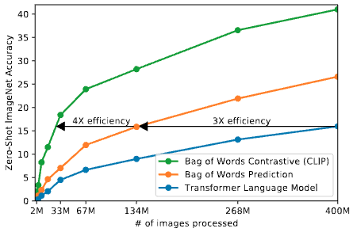

论文名称: Learning Transferable(迁移性好的) Visual Models From Natural Language Supervision

论文地址: https://arxiv.org/abs/2103.00020

readpaper地址: https://readpaper.com/pdf-annotate/note?pdfId=4498485025120608257&noteId=671513309851955200


## 摘要

State-of-the-art computer vision systems are trained to predict a fixed set of predetermined（固定的、提前定义好的） object categories. This restricted form of supervision limits their generality（泛化性） and usability since additional labeled data is needed to specify any other visual concept. Learning directly from raw text about images is a promising alternative（有前途的版本） which leverages a much broader source of supervision. We demonstrate that the simple pre-training task of predicting which caption goes with which image is an efficient（高效的） and scalable（可扩展的） way to learn SOTA image representations from scratch on a dataset of 400 million (image, text) pairs collected from the internet. After pre-training, natural language is used to reference learned visual concepts (or describe new ones) enabling zero-shot transfer of the model to downstream tasks. We study the performance of this approach by benchmarking on over 30 different existing computer vision datasets, spanning tasks such as OCR, action recognition in videos, geo-localization, and many types of fine-grained object classification. The model transfers non-trivially to most tasks and is often competitive with a fully supervised baseline without the need for any dataset specific training. For instance, we match the accuracy of the original ResNet-50 on ImageNet zero-shot without needing to use any of the 1.28 million training examples it was trained on. We release our code and pre-trained model weights at https://github.com/OpenAI/CLIP.

多模态对比学习 、 prompt
使用ImageNet训练的ResNet50的模型和CLIP预训练模型的对比效果，可以打平。

## 引言

Pre-training methods which learn directly from raw text have revolutionized(彻底改变) NLP over the last few years . (Dai &Le, 2015; Peters er al., 2018; Howard & Ruder, 2018; Radford et at., 2018; Devlin et al., 2018; Raffel et al., 2019). Task-agnostic objectives such as autoregressive（自回归预测） and masked language modeling have scaled across many orders of magnitude in compute, model capacity, and data, steadily improving capabilities. The development of "text-to-text"（文字进去、文字出去） as a standardized input-output interface (McCann et al., 2018; Radford et al., 2019; Raffel et al., 2019) has enabled taskagnostic architectures to zero-shot transfer to downstream datasets removing the need for specialized output heads or dataset specific customization.Flagship systems like GPT-3 (Brown et al., 2020) are now competitive across many tasks with bespoke models while requiring little to no dataset specific training data.


| 论文名称 | 论文标题翻译 | 论文别名 | 论文时间
| :------- | :------- | :------ | :--------
| Semi-supervised Sequence Learning                                                 | 基于半监督的序列学习                      | - | Dai &Le, 2015
| Deep contextualized word representations                                          | 深度上下文的词表达                        | - | Peters er al., 2018
| Universal Language Model Fine-tuning for Text Classification                      | 文本分类的通用语言模型微调方法              | ULMFiT | Howard & Ruder, 2018
| Improving Language Understanding by Generative Pre-Training                       | 通过生成式的预训练方式改善语言理解能力        | GPT | Radford et at., 2018 
| BERT: Pre-training of Deep Bidirectional Transformer for Language Understanding   | 用于语言理解的深度双向T预训练方法            | BERT | Devlin et al., 2018 
| Exploring the Limits of Transfer Learning with a Unified Text-to-Text Transformer | 使用一个统一的文本到文本的T来探索迁移学习的限制 | - | Raffel et al., 2019 
| The Natural Language Decathlon: Multitask Learning as Question Answering          | 自然语言十项全能：多任务学习当作问答          | MQAN | McCann et al., 2018 
| Language Models are Unsupervised Multitask Learners                               | 语言模型是无监督的多任务学习器               | GPT-2 | Radford er al, 2019 
| Language Models are Few-Shot Learners                                             | 语言模型是小样本学习器                      | GPT-3 | Brown et al., 2020


These results suggest that the aggregate supervision accessible to modern pre-training methods within web-scale collections of text surpasses that of high-quality crowd-labeled NLP datasets. However, in other fields such as computer vision it is still standard practice to pre-train models on crowd-labeled datasets such as ImageNet (Deng et al., 2009). Could scalable pre-training methods which learn directly from web text result in a similar breakthrough in computer vision? Prior work is encouraging.


| 论文名称 | 标题翻译 | 论文别名 | 论文时间
| :------- | :------- | :------ | :--------
| ImageNet: A large-scale hierarchical image database | 大规模分层图片数据库 | ImageNet | Deng et al., 2009


Over 20 years ago Mori et al. (1999) explored improving content based image retrieval by training a model to predict the nouns and adjectives in text documents paired with images. Quattoni et al. (2007) demonstrated it was possible to learn more data efficient image representations via manifold (流形)learning in the weight space of classifiers trained to predict words in captions associated with images. Srivastava & Salakhutdinov (2012) explored deep representation learning by training multimodal Deep Boltzmann Machines on top of low-level image and text tag features. Joulin et al.(2016) modernized this line of work and demonstrated that CNNs trained to predict words in image captions learn useful image representations. They converted the title, description, and hashtag（标签） metadata of images in the YFCC100M dataset (Thomee et al., 2016) into a bag-ofwords multi-label classification task and showed that pretraining AlexNet (Krizhevsky et al., 2012) to predict these labels learned representations which preformed similarly to ImageNet-based pre-training on transfer tasks. Li et al.(2017) then extended this approach to predicting phrase n-grams in addition to individual words and demonstrated the ability of their system to zero-shot transfer to other image classification datasets by scoring target classes based on their dictionary of learned visual n-grams and predicting the one with the highest score. Adopting more recent architecture and pre-training approaches, VirTex(Desai & Johnson,2020), ICMLM(Bulent Sariyildiz et al., 2020), and ConVIRT(Zhang et al., 2020) have recently demonstrated the potential of transformer-based language modeling, masked language modeling, and contrastive objectives to learn image representations from text.

跟这篇文章很相似 Li et al.(2017)

| 论文名称 | 标题翻译 | 论文别名 | 论文时间
| :------- | :------- | :------ | :--------
| Image-to-word transformation based on dividing and vector quantizing images with words | 依据单词将图片分割并向量化，来实现图片到文本的转换 | - | Mori et al. (1999) 
| Learning Visual Representations using Images with Captions                             | 学习有字幕图片的视觉表征 | - | Quattoni et al. (2007)
| Multimodal Learning with Deep Boltzmann Machines                                       | 使用玻尔兹曼机做多模态学习| - | Srivastava & Salakhutdinov (2012)
| Learning Visual Features from Large Weakly Supervised Data                             | 从大规模的弱监督数据中学习视觉特征 | - | Joulin et al.(2016)
| YFCC100M: The New Data in Multimedia Research                                          | 用于多媒体研究的新数据集 | YFCC100M | (Thomee et al., 2016)
| ImageNet Classification with Deep Convolutional Neural Networks                        | 使用卷积神经网络来做ImageNet分类 | AlexNet | (Krizhevsky et al., 2012) 
| Learning Visual N-Grams from Web Data                                                  | 从网页数据中学习视觉n-grams | - | Li et al.(2017)  
| VirTex: Learning Visual Representations from Textual Annotations                       | 从文本注释中学习视觉表征 | VirTex | VirTex(Desai & Johnson,2020)
| Learning Visual Representations with Caption Annotations                               | 从字幕中学习是视觉表征 | ICMLM | ICMLM(Bulent Sariyildiz et al., 2020) 
| Contrastive Learning of Medical Visual Representations from Paired Images and Text     | 从配对的图片-文本中学习医疗视觉表征 | ConVIRT | ConVIRT(Zhang et al., 2020)


While exciting as proofs of concept, using natural language supervision for image representation learning is still rare. This is likely because demonstrated performance on common benchmarks is much lower than alternative approaches(由于性能不高，所以将自然语言的监督信号使用的图片上，这样的工作还是比较少的). For example, Li et al.(2017) reach only 15% accuracy on ImageNet in a zero-shot setting. This is well below the 88.4% accurary of the current state of the art (Xie et al., 2020). It is even below the 50% accuracy of classic computer vision approaches (Deng et al., 2012).(Li是零样本推理，其他工作是在有监督训练后进行的评估) Instead, more narrowly(狭隘地) scoped but well-targeted uses of weak supervision have improved performance.(相比无监督训练，弱监督训练的效果相对更好一点) Mahajan et al.(2018) showed that predicting ImageNet-related hashtags(标签)(也是一种监督信号，只不过不是自然语言监督信号) on Instagram images is an effective pre-training task. When fine-tuned to ImageNet these pre-training models increased accuracy by 5% and improved the overall(全面的) state of the art at the time.Kolesnikov et al. (2019) and Dosovitskiy et al. (2020) have also demonstrated large grains on a broader set of transfer benchmarks by pre-training models to predicts the classes of the noisily labeled JFT-300M dataset(这些脏数据虽然没那么准，但也是一种自然语言的弱监督信号).


| 论文名称 | 标题翻译 | 论文别名 | 论文时间
| :------- | :------- | :------ | :--------
| Learning Visual N-Grams from Web Data                                                  | 从网页数据中学习视觉n-grams | - | Li et al.(2017) 
| Self-training with Noisy Student improves ImageNet classification                      | 使用噪声学生的自学习来提升图片分类效果 | - | (Xie et al., 2020)
| Exploring the Limits of Weakly Supervised Pretraining                                  | 探索弱监督预训练的限制 | - | Mahajan et al.(2018)
| Large Scale Learning of General Visual Representations for Transfer                    | 学习大规模通用视觉表征用于迁移学习 | BiT |  Kolesnikov et al. (2019)
| An Image is Worth 16x16 Words: Transformers for Image Recognition at Scale             | transformer用于图片分类 | ViT | Dosovitskiy et al. (2020)


This line of work represents the current pragmatic(务实的、实用主义的) middle ground（中间立场/中间地带）between learning from a limited amount of supervised "gold-labels"（固定标签的） learning from practically unlimited amounts of raw text. However, it it not without compromises(然而，这并非不能妥协). Both works carefully design, and in the process limit, their supervision to 1000 and 18291 classes respectively. Natural language is able to express, supervise, a much wider set of visual concepts through its generality. Both approaches also use static softmax classfifiers to perform prediction and lack a mechanism for dynamic outputs. This severely(严重地) curtails（削减了） their flexibility and limits their "zero-shot" capabilities.


A crucial difference between these weakly supervised models and recent explorations of learning image representations directly from natural language is scale(两者的区别是规模的不同). While Mahajan et al.(2018) and Kolesnikov et al. (2019) trained their models for accelerator（gpu或者tpu等硬件，相比cpu是加速的） years on millions to billions of images（百万到十亿级规模）, VirTex, ICMLM, and ConVIRT (这三个方法相比前面几个方法，训练的时间短，使用的数据量小)trained for accelerator days（多少天） on one to two hundred thousand images（几十万规模）. In this work（数据规模变大）, we close this gap and study the behaviors of image classifiers trained with natural language supervision at large scale. Enabled by the large amounts of publicly available data of this form on the internet, we create a new dataset of 400 million (image, text) pairs and demonstrate that a simplified version of ConvVIRT trained from scratch, which we call CLIP, for Contrastive Language-Image  Pre-training, is an efficient method of learning from natural language supervision. We study the scalability of CLIP by training a series of eight models（从resnet->efficientnet->vit-L） spanning almost 2 orders of magnitude of compute(计算量提升了100倍) and observe that transfer performance is a smoothly predictable function of compute（迁移学习的效果和计算量基本上是成正相关的） (Hestness et al., 2017; Kaplan et al., 2020). We find that CLIP, similar to the GPT family, learns to perform a wide set of tasks during pre-training including OCR, geo-localization, action recognition, and many others. We measure this by benchmarking the zero-shot transfer performance of CLIP on over 30 existing datasets and find it can be competitive with prior task-specific supervised models. We also confirm(确认) these findings with linear-probe(骨干网络冻住，用作抽取特征，再加分类头) representation learning analysis and show that CLIP outperforms the best publicly available ImageNet model while also being more computationally efficient. We additionally find that zero-shot CLIP models are much more robust（更鲁棒的，在素描数据集上的效果也挺好） than equivalent(相等的) accuracy supervised ImageNet models which suggests that zero-shot evaluation of task-agnostic models is much more representative of a model's capability. (我们还发现，零样本 CLIP 模型比同等精度的监督 ImageNet 模型更稳健，这表明任务无关模型的零样本评估更能代表模型的能力). These results have significant policy(政策的) and ethical（伦理的） implications, which we consifer in Section 7.


| 论文名称 | 标题翻译 | 论文别名 | 论文时间
| :------- | :------- | :------ | :--------
| Exploring the Limits of Weakly Supervised Pretraining                                  | 探索弱监督预训练的限制 | - | Mahajan et al.(2018) 弱监督方法
| Large Scale Learning of General Visual Representations for Transfer                    | 学习大规模通用视觉表征用于迁移学习 | BiT |  Kolesnikov et al. (2019) 弱监督方法
| Deep Learning Scaling is Predictable, Empirically                                      | 深度学习的扩展情况是可预测的，是有经验值的 | - | Hestness et al., 2017
| Scaling Laws for Neural Language Models                                                | 自然语言模型的扩展规则 | - | Kaplan et al., 2020


## 方法


#### 自然语言监督 
At the core of our approach is the idea of learning perception from supervision contained in natural language. As discussed in the introduction, this is not at all a new idea, however, terminology(术语、用于) used to describe work in this space is varied, even seemingly contradictory(矛盾的), and stated motivations are diverse. Zhang et al. (2020), Gomez et al. (2017), Joulin et al. (2016), and Desai & Johnson (2020) all introduce methods which learn visual representations from text paired with images but describe their approaches as unsupervised, self-supervised, weakly supervised, and supervised respectively.


| 论文名称 | 标题翻译 | 论文别名 | 论文时间
| :------- | :------- | :------ | :--------
| Contrastive Learning of Medical Visual Representations from Paired Images and Text     | 从配对的图片-文本中学习医疗视觉表征 | ConVIRT | ConVIRT(Zhang et al., 2020)
| Self-Supervised Learning of Visual Features through Embedding Images into Text Topic Spaces | 通过把图片嵌入到文本空间中，来用自监督的方式学习视觉特征 | - | Gomez et al. (2017)
| Learning Visual Features from Large Weakly Supervised Data                             | 从大规模的弱监督数据中学习视觉特征 | - | Joulin et al.(2016)
| VirTex: Learning Visual Representations from Textual Annotations                       | 从文本注释中学习视觉表征 | VirTex | VirTex(Desai & Johnson,2020)

We emphasize that what is common across this line of work is not any of the details of th particular methods used but the appreciation(欣赏) of natural language as a training signal(把自然语言作为一种训练信号). All these approaches are learning from natrual language supervision. Although early work wrestled(摔跤) with the complexity of natural language when using topic model and n-gram representations, improvements in deep contextual representation learning（具有上下文语义环境的学习方式） suggest we now have the tools to effectively leverage（利用） this abundant source of supervision(McCann et al., 2017).


| 论文名称 | 标题翻译 | 论文别名 | 论文时间
| :------- | :------- | :------ | :--------
| Learned in Translation: Contextualized Word Vectors                                    | 上下文词向量，学习用于翻译 | - | McCann et al., 2017

Learning from natual language has several potential strengths(优势) over other training methods. It's much easier to scale natural language supervision compared to standard crowd-sourced labeling 
for image classification since it does not require annotations to be in a classic "machine learning compatible(兼容的) format" such as the canonical(典范) 1-of-N majority vote "gold label". Instead, methods which work on natural language can learn passively(被动地) from the supervision contained  in the vast amount of text on the internet. Learning from natural language also has an important advantage over most unsupervised or self-supervised learning approaches in that it doesn't "just" learn a representation but also connects that repesentation to language which enables flexible zero-shot transfer. (与大多数无监督或自监督学习方法相比，从自然语言中学习还有一个重要的优势，因为它不仅“只是”学习一种表示，而且还将这种表示与语言联系起来，从而就能实现灵活的零样本迁移)
In the following subsections, we detail the specific approach we settled on.


#### Creating a Sufficiently Large Dataset

Existing work has mainly used three datasets, MS-COCO(Lin et al., 2014), Visual Genome(Krishna et al., 2017), and YFCC100M(Thomee et al., 2016). While MS-COCO and Visual Genome are high quality crowd-labeled datasets, they are small by modern standards with approximately 100,000 training photos each. By comparison, other computer vision systems are trained on up to 3.5 billion  Instagram photos(Mahajan et al., 2018). YFCC100M, at 100 million photos, is a possible alternative, but the metadata for each image is sparse and of varying quality(稀疏且质量参差不齐的). Many images use automatically generated filenames like 20160716_113957.JPG as "titles" or contain "descriptions" of camera exposure settings. After filtering to keep only images with natural language titles and/or descriptions in English, the dataset shrunk by a factor of 6 to only 15 million photos. This is approximately the same size as ImageNet.


A major motivation for natural language supervision is the large quantities of data of this form available publicly on the internet. Since existing datasets do not adequately(充分地) reflect this possibility, considering results only on them would underestimate(低估) the potential of this line of research.(现有的数据集量级比较小，因此不能完全反映出用海量互联网的自然语言数据做监督能做成事情的可能性，仅仅使用这样的数据集，可能会低估这方面研究的潜力). To address this, we constructed a new dataset of 400 million (image,text) pairs collected form a variety of publicly available sources on the Internet. To attempt to cover as broad a set of visual concepts as possible, we search for (image, text) pairs as part of the construction process(构建数据过程中) whose text includes one of a set of 500,000 queries. We approximately class balance the results by including up to 20,000(image,text) pairs per query. The resulting dataset has a similar total word count as the WebText dataset used to train GPT-2. We refer to this dataset as WIT for WebImageText.


| 论文名称 | 标题翻译 | 论文别名 | 论文时间
| :------- | :------- | :------ | :--------
| Microsoft COCO: Common Objects in Context | 上下文中的常见物体 | COCO | Lin et al., 2014
| Visual Genome: Connecting Language and Vision Using Crowd sourced Dense Image Annotations | 视觉基因组: 使用众包的密集图像标注来连接语言和视觉 | - | Krishna et al., 2017
| YFCC100M: The New Data in Multimedia Research | 多媒体研究中的新数据集 | YFCC100M | Thomee et al., 2016
| Exploring the Limits of Weakly Supervised Pretraining                                  | 探索弱监督预训练的限制 | - | Mahajan et al.(2018)


#### 2.3 Selecting an Efficient Pre-Training Method

State-of-the-art computer vision systems use very large amounts of compute. Mahajan et al.(2018) required 19 GPU years to train their ResNeXt101-32x48d and Xie et al.(2020) required 33 TPUv3 core-years to train their Noisy Student EfficientNet-L2. When considering that both these systems were trained to predict only 1000 ImageNet classes, the task of learning an open set of visual concepts from natural language seems daunting(令人生畏). In the course of our efforts, we found training efficiency(训练效率) was key to successfully scaling natural language supervision(成功扩展自然语言监督的关键) and we selected our final pre-training method based on this metric.

| 论文名称 | 标题翻译 | 论文别名 | 论文时间
| :------- | :------- | :------ | :--------
| Exploring the Limits of Weakly Supervised Pretraining                                  | 探索弱监督预训练的限制 | - | Mahajan et al.(2018)
| Self-training with Noisy Student improves ImageNet classification                      | 使用噪声学生的自学习来提升图片分类效果 | - | (Xie et al., 2020)


Our initial approach, similar to VirTex, jointly trained an image CNN and text transformer from scratch to predict the caption of an image. However, we encountered difficulties efficiently scaling this method. In Figure 2 we show that a 63 million parameter transformer language model, which already uses twice the compute of its ResNet-50 image encoder, learns to recognize ImageNet classes three times slower than a much simpler baseline that predicts a bag-of-words encoding of the same text. 


Both these approaches share a key similarity. They try to predict the exact words of the text accompanying each image. This is a difficult task due to the wide variety of descriptions, comments, and related text that co-occur with images. Recent work in contrastive representation learning for images has found that contrastive objectives can learn better representations than their equivalent predictive objective (Tian et al., 2019). Other work has found that although generative models of images can learn high quality image representations, they require over an order of magnitude (超过一个数量级) of more compute than contrastive models with the same performance(Chen et al., 2020a). Noting these findings, we explored training a system to solve the potentially easier proxy task of predicting only which text as a whole(整个文本) is paired with which image and not the exact words(确切的词) of that text. Starting with the same bag-of-words encoding baseline, we swapped the predictive objective（预测性的任务） for a contrastive objective（对比性的的任务） in Figure 2 and observed a further 4x efficientcy improvement in the rate of zero-shot transfer to ImageNet.

去预测图片对应的文本中的单个词 -> 去预测图片对应的文本中的单个词的表征（效果提升3倍） -> 去预测图片与文本是否对应（效果进一步提升4倍）

| 论文名称 | 标题翻译 | 论文别名 | 论文时间
| :------- | :------- | :------ | :--------
| Contrastive Multiview Coding | 对比的多角度编码 | - | Tian et al., 2019
| Generative Pretraining From Pixels | 从像素做生成式的预训练 | - | Chen et al., 2020a



图2 **CLIP is much more efficient at zero-shot transfer than our image caption baseline.** Althougn highly expressive(富有表现力), we found that transformer-based language models are relatively weak at zero-shot ImageNet classification. Here, we see that it learns 3x slower than a baseline which predicts a bag-of-words(BoW) encoding of the text(Joulin et al., 2016). Swapping the prediction objective for the contrastive objective of CLIP further improves efficiency another 4x.


Given a batch of N(image, text)pairs, CLIP is trained to predict which of the NxN possible(image, text) pairings across a batch actually occurred. To do this, CLIP learns a multi-modal embedding space by jointly training an image encoder and text encoder to maximize the cosine similarity of the image and text embeddings of the N real pairs in the batch while minimizeing the cosine similarity of the embeddings of the N^2 - N incorrect pairings. We optimize a symmetric cross entropy loss over these similarity scores. In figure 3, we include pseudocode of the core of an implementation of CLIP. To our knowledge this batch construction technique and objectives was first introduced in area of deep metric learning as the multi-class N-pair loss Sohn(2016) was popularized for contrastive representation learning by Oord et al.(2018) as the InfoNCE loss, and was recently adapted for contrastive(text, image) representation learning in the domain of medical imaging by Zhang et al.(2020).


| 论文名称 | 标题翻译 | 论文别名 | 论文时间
| :------- | :------- | :------ | :--------
| Improved deep metric learning with multi-class N-pair loss objective | 使用多分类的多对的损失函数来提升深度评估学习能力 | - 2016-12-05
| Representation Learning with Contrastive Predictive Coding | 使用对比预测编码来进行表征学习 | CPC |  Oord et al.(2018)
| Contrastive Learning of Medical Visual Representations form Paired Images and Text | 使用成对的图片文本进行对比学习，用于医疗视觉表征 | Zhang et al.(2020)


```python
# image_encoder - ResNet of Vision Transformer
# text_encoder  - CBOW or Text Transformer
# I[n, h, w, c] - minibatch of aligned images
# T[n, l]       - minibatch of aligned texts
# W_i[d_i, d_e] - learned proj of image to embed
# W_t[d_t, d_e] - learned proj of text to embed
# t             - learned temperature parameter

# extract feature representations of each modality
I_f = image_encoder(I) # [n, d_i]
T_f = text_encoder(T)  # [n, d_t]

# joint multimodal embedding [n, d_e]
I_e = l2_normalize(np.dot(I_f, W_i), axis=1)
T_e = l2_normalize(np.dot(T_f, W_t), axis=1)

# scaled pairwise cosine similarities [n, n]
logits = np.dot(I_e, T_e.T) * np.exp(t)

# symmetric loss function
labels = np.arange(n)
loss_i = cross_entropy_loss(logits, labels, axis=0)
loss_t = cross_entropy_loss(logits, labels, axis=1)
loss = (loss_i + loss_t) / 2
```

图3 Numpy-like pseudocode for the core of an implementation of CLIP


Due to the large size of our pre-training dataset, over-fitting is not a major concern and the details of training CLIP are simplified compared to the implementation of Zhang et al.(2020). We train CLIP form scratch without initiallizeing the image encoder with ImageNet weights or the text encoder with pre-trained weights. We do not use the non-linear projection between the representation and the contrastive embedding space, a change which was introduced by Bachman et al.(2019) and popularized by Chen et al.(2020b). We instead use only a linear projection to map from each encoder's representation to the multi-modal embedding space. We did not notice a difference in training two versions and speculate(推测) that non-linear projections may be co-adapted with details of current image only in self-supervised representation learning methods. We also remove the text transformation function `{t_u}` from Zhang et al.(2020) which samples a single sentence at uniform from the text since many of the (image, text) pairs in CLIP's pre-training dataset are only a single sentence. We also simplify the image transformation function $t_v$. A random square crop from resized images is the only data augmentation used during training. Finally, the temperature parameter which controls the range of the logits in the softmax, $\tau$, is directly optimized during training as a log-parameterized multiplicative scalar to avoid turning as a hyper-parameter.

| 论文名称 | 标题翻译 | 论文别名 | 论文时间
| :------- | :------- | :------ | :--------
| Contrastive Learning of Medical Visual Representations form Paired Images and Text | 使用成对的图片文本进行对比学习，用于医疗视觉表征 | Zhang et al.(2020)
| A Simple Framework for Contrastive Learning of Visual Representations | 一个简单的框架用于视觉表征的对比学习 | SimCLR | Chen et al.(2020b)


#### Choosing and Scaling a Model

We consider two different architectures for the image encoder. For the first, we use ResNet-50 as the base architecture for the image encoder due to its widespread adoption and proven performance. We make several modifications to the original version using the ResNet-D improvements from He et al.(2019) and the antialiased(抗锯齿) rect-2 blur(模糊) pooling from Zhang(2019). We also replace the global average pooling layer with an attention pooling mechanism. The attention pooling is implemented as a single layer of "transformer-style" multi-head QKV attention where the query is conditioned on the global average-pooled representation of the image. For the second architecture, we experiment with the recently introduced Vision Transformer(ViT)(Dosovitskiy et al.,2020). We closely follow their implementation with only the minor modification of adding an additional layer normalization to the combined patch and position embeddings before the transformer and use a slightly different initialization scheme(方案).

| 论文名称 | 标题翻译 | 论文别名 | 论文时间
| :------- | :------- | :------ | :--------
| Bag of Tricks from Image Classification with Convolutional Neural Networks | 用卷积神经网络做图片分类的一堆技巧 | - | He et al.(2019)
| Making Convolutional Networks Shift-Invariant Again | 使卷积神经网络更加尺度不变 | - | Zhang(2019)
| An Image is Worth 16x16 Words: Transformers for Image Recognition at Scale             | transformer用于图片分类 | ViT | Dosovitskiy et al. (2020)


The text encoder is a Transformer(Vaswani et al.,2017) with the architecture modifications described in Radford et al.(2019). As a base size we use a 63M-parameter 12 layer 512-wide model with  8 attention heads. The transformer operates on lower-cased byte pair encoding(BPE) representation of the text with a 49,152 vocab size(Sennrich et al.,2015). For computational efficiency, the max sequence length was capped(上限) at 76. The text sequence is bracketed with(用括号括起来) [SOS] and [EOS] tokens and the activations of the highest layer of the transformer at the [EOS] token are treated as the feature representation of the text which is layer normalized and then linearly projected into the multi-modal embedding space. Masked self-attention was used in the text encoder to preserve the ability to initialize with a pre-trained language model or add language modeling as an auxiliary(辅助) objective, though exploration of this is left as future work. 


| 论文名称 | 标题翻译 | 论文别名 | 论文时间
| :------- | :------- | :------ | :--------
| Attention Is All You Need | 注意力机制是你需要的 | ViT | Vaswani et al.,2017
| Language Models are Unsupervised Multitask Learners                               | 语言模型是无监督的多任务学习器               | GPT-2 | Radford er al, 2019 

While previous computer vision research has often scaled models by increasing the width(Mahajan et al., 2018) or depth(He et al., 2016a) in isolation(隔离的，单独的), for the ResNet image encoders we adapt the approach of Tan & Le(2019) which found that allocating(分配) additional compute across all of width, depth, and resolution outperforms only allocating(分配) it to only one dimension of the model. While Tan & Le(2019) tune the ratio of compute allocated to each dimension for their EfficientNet architecture, we use a simple baseline of allocating additional compute equally to increasing the width, depth, and resolution of the model. For the text encoder, we only scale the width of the model to be proportional(成比例的) to the calculated increase in width of the ResNet and do not scale the depth at all, as we found CLIP's performance to be less sensitive to the capacity of the text encoder.


| 论文名称 | 标题翻译 | 论文别名 | 论文时间
| :------- | :------- | :------ | :--------
| Exploring the Limits of Weakly Supervised Pretraining                                  | 探索弱监督预训练的限制 | - | Mahajan et al.(2018)
| Deep Residual Learning for Image Recognition | 使用深度残差网络来做视频分类任务 | ResNet | He et al., 2016a
| EfficientNet: Rethinking Model Scaling for Convolutional Neural Networks | EfficientNet: 重新思考卷积神经网络模型扩展问题 | EfficientNet | Tan & Le(2019) 

#### 2.5 Training 

We train a series of 5 ResNets and 3 Vision Transformers. For the ResNets we train a ResNet-50, a ResNet-101, and then 3 more which follow EfficientNet-style model scaling and use approximately 4x, 16x, 64x the compute of a ResNet-50. They are denoted as RN50x4, RN50x16, and RN50x64 respectively. For the Vision Transformers we train a ViT-B/32, a ViT-B/16, and a ViT-L/14.  We train all models for 32 epochs. We use the Adam optimizer(Kingma & Ba, 2014) with decoupled(解耦的) weight decay regularization (Loshchilov & Hutter, 2017) applied to all weights that are not gains or biases, and decay the learning rate unsing a cosine schedule(Loshchilov & Hutter, 2016). Initial hyper-parameters were set using a comnination of grid searches, random search, and manual tuning on the baseline ResNet-50 model when trained for 1 epoach. Hyper-parameters were then adapted heuristically(启发式的) for larger models due to computational constraints. The learnable temperature parameter $\tau$ was initialized to the equivalent of 0.07 from (Wu et al., 2018). and clipped(剪切) to prevent scaling the logits by more than 100 which we found necessary to prevent(防止) training instability（不稳定）. We use a very large minibatch size of 32,768. Mixed-precision(Micikevicius et al., 2017) was used to accelerate training and save memory. To save additional memory, gradient checkpointing(梯度检查点) (Griewank & Walther, 2000; Chen et al.,2016), half-precision Adam statistics(Dhariwal et al.,2020), and half-precision stochastically rounded(半精度随机四舍五入的) text encoder weights were used. The calculation(计算) of embedding similarities was also sharded with individual GPUs computing only the subset of the pairwise similarities necessary for their local batch of embeddings. The largest ResNet model, RN50x64, took 18 days to train on 592 V100 GPUs while the largest Vision Transformer took 12 days on 256 V100 GPUs. For the ViT-L/14 we also pre-train at a higher 336 pixel resolution for one additional epoch to boost performance similar to FixRes(Touvron et al.,2019). We denote this model as ViT-L/14@336px. Unless otherwise specified(除非另有规定), all results reported in this as "CLIP" use this model which we found to perform best.


| 论文名称 | 标题翻译 | 论文别名 | 论文时间
| :------- | :------- | :------ | :--------
| Adam: A Method for Stochastic(随机) Optimization | 随机优化的一种方法 | Adam | Kingma & Ba, 2014
| Decoupled Weight Decay Regularization | 解耦的权重衰减正则化 | - | Loshchilov & Hutter, 2017
| SGDR: Stochastic Gradient Descent with Warm Restarts | 使用热启动的方式和随机梯度下降相结合 | SGDR | Loshchilov & Hutter, 2016
| Unsupervised Feature Learning via Non-Parametric Instance-level Discrimination | 通过无参数实例级别判别的无监督特征学习 | - | Wu et al., 2018
| Mixed Precision Training | 混合精度训练 | - | Micikevicius et al., 2017
| Algorithm 799: revolve: an implementation of checkpointing for the reverse or adjoint mode of cumputational differentiation | 计算微分的反向或伴随模式的检查点实现 | - | Griewank & Walther, 2000
| Training Deep Nets with Sublinear Memory Cost. | 使用次线性内存成本训练深度网络 | - | Chen et al.,2016
| Jukebox: A Generative Model for Music | 用于音乐的一个生成式模型 | - | Dhariwal et al.,2020
| Fixing the train-test resolution dicrepancy | 修复训练-测试分辨率差异 | - | Touvron et al.,2019

## 3. 实验

#### 3.1 零样本迁移

###### 3.1.1 Motivation

In computer vision, zero-shot learning usually refers to the study of generalizing to unseen object categories in image classification(Lampert et al.,2009). We instead use the term in a broader sense and study generalization to unseen datasets. We motivate this as a proxy for performing unseen tasks, as aspired to in the zero-data learning paper of Larochelle et al.(2008). While much research in the filed of unsupervised learning focuses on the representation learning capabilities of machine learning systems, we motivate studying zero-shot transfer as a way of measuring the task-learning capabilities of machine learning systems. In this view, a dataset evaluates performance on a task on a specific distribution. However, many popular computer vision datasets were created by the research community primarily as benchmarks to guide the development of generic image classification methods rather than measuring performance on a specific task. While it is reasonable to say that(可以这么说) the SVHN dataset measures the task of street number transciption on the distribution of Google Street View photos, it is unclear what "real" task the CIFAR-10 dataset measures. It is clear, however, what distribution CIFAR-10 is drawn from - TinyImages(Torralba et al.,2008). On these kinds of datasets, zero-shot transfer is more an evaluation of CLIP's robustness to distribution shift and domain generalization rather tahn task generalization. Please Section 3.3 for analysis focused on this.

| 论文名称 | 标题翻译 | 论文别名 | 论文时间
| :------- | :------- | :------ | :--------
| Learning To Detect Unseen Object Classes by Between-Class Attribute Transfer | 通过类之间属性迁移，来学会检测没见过的物体类别 | - | Lampert et al.,2009
| Zero-data learning of new tasks | 新任务的零样本学习 | - | Larochelle et al.(2008)

To our knowledge, Visual N-Grams(Li et al.,2017) first studied zero-shot transfer to existing image classification datasets in the manner described above. It is also the only other work we are aware of that has studied zero-shot transfer to standard image classification datasets using a generically pre-trained model and serves as(充当) the best reference point for contextualizing CLIP. Their approach learns the parameters of a dictionary of 142806 visual n-grams(spaning 1- to 5- grams) and optimizes these n-grams using a differential version of Jelinek-Mercer smoothing to maximize the probability of all text n-grams for a given image. In order to perform zero-shot transfer, they first convert the text of each of the dataset's class names into its n-gram representation and then compute its probability according to their model, predicting the one with the highest score.


| 论文名称 | 标题翻译 | 论文别名 | 论文时间
| :------- | :------- | :------ | :--------
| Learning Visual N-Grams from Web Data | 从网页数据中学习视觉N-Grams | - | Li et al.,2017

插入一点内容

Learning Visual N-Grams from Web Data

Real-world image recognition systems need to recognize tens of thousands of classes that constitute(构成) a plethora of (许多的) visual concepts. The traditional approach of annotating thousands of images per class for training is infeasible(不可行的) in such a scenario(这种情况下), prompting the use of webly supervised data. This paper explores the training of image-recognition systems on large numbers of images and associated user comments. In particular, we develop visual n-gram models that can predict arbitrary phrases that are relevant to the content of an image. Our visual n-gram models are feed-forward convolutional networks trained using new loss functions that are inspired by n-gram models commonly used in language modeling. We demonstrate the merits of our models in phrase prediction, phrase-based image retrieval, relating images and captions, and zero-shot transfer.


Our focus on studying zero-shot transfer as an evaluation of task learning is inspired by work demonstrating task learning in the field of NLP. To our knowledge Liu et al.(2018) first identified task learning as an "unexpected side-effect"(不期望的副作用) when a language model trained to generate Wikipedia articles learned to reliably transliterate(音译) names between languages. While GPT-1(Radford et al.,2018) focused on pre-training as a transfer learning method to improve supervised fine-tuning, , it also included an ablation study demonstrating that the performance of four heuristic(启发式的) zero-shot transfer methods improved steadily over the course of pre-training(在预训练过程中稳定地改善), without any supervised adaption. This analysis served as the basis for GPT-2(Radford et al.,2019) which focused exclusively(仅) on studying the task-learning capabilities of language models via zero-shot transfer.

| 论文名称 | 标题翻译 | 论文别名 | 论文时间
| :------- | :------- | :------ | :--------
| Generating Wikipedia by Summarizing Long Sequences | 通过归总长序列来生成wiki | - | Liu et al.(2018) 

###### 3.1.2 Using CLIP for Zero-shot Transfer

CLIP is pre-trained to predict if an image and a text snippet(片段) are paired together in its dataset. To perform zero-shot classification, we reuse this capability. For each dataset, we use the names of all the classes in the dataset as the set of potential text pairings and predict the most probable(可能的)(image, text) pair according to CLIP. In a bit more detail, we first compute the feature embedding of the image and the feature embedding of the set of possible texts by their respective(各自的) encoders. The cosine similarity of these embeddings is then calculated, scaled by a temperature parameter $\tau$, and normalized into a probability distribution via a softmax. Note that this prediction layer is a multinormial(多项的) logistic regression classifier with L2-normalized inputs, L2-normalized weights, no bias, and temperature scaling. When interpreted this way, the image encoder is the computer vision backbone which computes a feature representation for the image and the text encoder is a hypernetwork(Ha et al.,2016) which generates the weights of a linear classifier based on the text specifying the visual concepts that the classes represent. Lei Ba et al.(2015) first introduced a zero-shot image classifier of this form while the idea of generating a classifier from natual language dates back to at least Elhoseiny et al.(2013). Continuing with this interpretation, every step of CLIP pre-training can be viewed as optimizeing the performance of a randomly created proxy to a computer vision dataset which contains 1 example per class and has 32768 total classes defined via natural language descriptions. For zero-shot evaluation, we cache the zero-shot classifier once it has been computed by the text encoder and reuse it for all subsequent predictions. This allows the cost(成本) of generating it to be amortized(分摊) across all the predictions in a dataset.


| 论文名称 | 标题翻译 | 论文别名 | 论文时间
| :------- | :------- | :------ | :--------
| HyperNetworks | 超网络 | - | Ha et al.,2016
| Predicting Deep Zero-Shot Convolutional Neural Networks using Textual Descriptions | 使用文本性的描述来预测深度零样本卷积网络 | - | Lei Ba et al.(2015)
| Write a Classifier: Zero-Shot Learning Using Purely Textual Descriptions | 使用纯文本描述来做零样本学习 | - | Elhoseiny et al.(2013)

###### 3.1.3 Initial Comparison to Visual N-Grams

In Table 1 we compare Visual N-Grams to CLIP. The best CLIP model improves accuracy on ImageNet from a proof of concept 11.5% to 76.2% and matches the performance of the original ResNet-50 despite using none of the 1.28 million crowd-labeled training examples available for this dataset. Additionally, the top-5 accuracy of CLIP models are noticeably higher than their top-1, and this model has a 95% top-5 accuracy, matching Inception-V4(Szegedy et al.,2016). The ability to match the performance of a strong, fully supervised baselines in a zero-shot setting suggests CLIP is a significant step towards flexible and practical zero-shot computer vision classifiers. As mentioned above, the comparison to Visual N-Grams is meant for contextualizing the performance of CLIP and should not be interpreted as a direct methods comparison between CLIP and Visual N-Grams as many performance relevant differences between the two systems were not controlled for. For instance, we train on a dataset that is 10x larger, use a vision model that requires nearly 100x more compute per prediction, likely used over 1000x their training compute, and use a transformer-based model which did not exist when Visual N-Grams was published. As a closer comparison, we trained a CLIP ResNet-50 on the same YFCC100M dataset that Visual N-Grams was trained on and found it matched their reported ImageNet performance within a V100 GPU day. This baseline was also trained from scatch instead of being initiallized from pre-trained ImageNet weights as in Visual N-Grams.


| -              | aYahoo | ImageNet | SUN
| :------------- | :----- | :------- | :----
| Visual N-Grams | 72.4   | 11.5     | 23.0
| CLIP           | 98.4   | 76.2     | 58.5

Table 1. Comparing CLIP to prior zero-shot transfer image classification results. CLIP improves performance on all three datasets by a large amount. This improvement reflects(反映了) many differences in the 4 years since the development of Visual N-Grams(Li et al.,2017).

CLIP also outperforms Visual N-Grams on the other 2 reported datasets. On a Yahoo, CLIP achieves a 95% reduction(减少) in the number of errors, and on SUN, CLIP more than doubles the accuracy of Visual N-Grams. To conduct a more comprehensive analysis and stress test, we implement a much larger evaluation suite detailed in Appendix A. In total we expand from the 3 datasets reported in Visual N-Grams to include over 30 datasets and compare to over 50 existing computer vision systems to contextualize results.

###### 3.1.4 Prompt Engineering And Ensembling

Most standard image classification datasets treat the information naming or describing classes which enables narural language based(基于自然语言) zero-shot transfer as an afterthought(事后想法). The vast majority of datasets annotate images with just a numeric id of the label and contain a file mapping these ids back to their names in English. Some datasets, such as Flowers102 and GTSRB, don't appear to include this mapping at all in their released versions preventing(防止) zero-shot transfer entirely. For many datasets, we observed these labels may be chosen somewhat(有些) haphazardly(随意) and do not anticipate(预测) issues related to zero-shot transfer which relies on task description in order to transfer successfully.


A common issue is polysemy(歧义性). When the name of a class is the only information provided to CLIP's text encoder it is unable to differentiate which word sense is meant due to the lack of context. In some cases multiple meanings of the same word might be included as different classes in the same dataset! This happens in ImageNet which contains both construction cranes(建筑起重机) and cranes that fly.(飞的鹤). Another example is found in classes of the Oxford-IIIT Pet dataset where the word boxer(拳师犬、拳击手) is, from context, clearly referring to a breed of dog, but to a text encoder lacking context could just as likely refer to a type of athlete(运动员).


Another issue we encountered is that it's relatively rare in our pre-training dataset for the text paired with the image to be just a single word. Usually the text is a full sentence describing the image in some way. To help bridge this distribution gap, we found that using the prompt template "A photo of a {label}." to be a good default that helps the text is about the content of the image. This often improves performance over the baseline of using only the label text. For instance, just using this prompt improves accuracy on ImageNet by 1.3%.

Similar to the "prompt engineering" discussion around GPT-3(Brown et al.,2020; Gao et al.,2020), we have also observed that zero-shot performance can be significantly improved by customizing(定制) the prompt text to each task. A few, non exhaustive, examples follow(以下是一些非详尽的示例). We found that on several fine-grained image classification datasets that it helped to specify(指定) the category. For example on Oxford-IIIT Pets, using "A photo of a {label}, a type of pet." to help provide context worked well. Likewise, on Food101 specifying a type of food and on FGVC Aircraft a type of aircraft helped too. For OCR datasets, we found that putting quotes(引号)around the text or number to be recognized improved performance. Finally, we found that on satellite image classification datasets it helped to specify that the images were of this form and we use variants of "a satellite phot of a {label}."

We also experimented with ensembling over multiple zero-shot classifiers as another way of improving performance.These classifiers are computed by using different context prompts such as "A photo of a big {label}" and "A photo of a small {label}". We construct the ensemble over the embedding space instead of probability space. This allows us to cache a single set of averaged text embeddings so that the compute cost of the emsemble is the same as using a single classifier when amortized(分摊) over many predictions. We've observed ensembling across many generated zero-shot classifiers to reliably improve performance and use it for the majority of datasets. On ImageNet, we ensemble 80 different context prompts and this improves performance by an additional 3.5% over the single default prompt discussed above. When considerd together, prompt engineering and ensembling improve ImageNet accuracy by almost 5%. In Figure 4 we visualize how prompt engineering and ensembling change the performance of a set of CLIP models compared to the contextless baseline approach of directly embedding the class name as done in Li et al.(2017).

Figure4. Prompt engineering and ensembling improve zero-shot performance, Compared to the baseline of using contextless class names, prompt engineering and ensembling boost zero-shot classification performance by almost 5 points on average across 36 datasets. This improvement is similar to the gain from using 4 times more compute with the baseline zero-shot method but is "free" when amortized over many predictions.


| 论文名称 | 标题翻译 | 论文别名 | 论文时间
| :------- | :------- | :------ | :--------
| Language Models are Few-Shot Learners                                             | 语言模型是小样本学习器                      | GPT-3 | Brown et al., 2020
| Making Pre-trained Language Models Better Few-shot Learners. | 使预训练语言模型比少样本学习器更好 | - | Gao et al.,2020


###### 3.1.5 Analysis of Zero-shot CLIP Performance

Since task-agnostic zero-shot classifiers for computer vision have been understudied, CLIP provides a promising opportunity to gain a better understanding of this type of model. In this section, we conduct a study of various properties of CLIP's zero-shot classifiers. As a first question, we look simply at how well zero-shot classifiers perform. To contextualize this, we compare to the performance of a simple off-the-shelf(现成的) baseline: fitting a fully supervised, regularized, logistic regression classifier on the features of the canonical(经典的) ResNet-50. In Figure 5 we show this comparison across 27 datasets. Please see Apprendix A for details of datasets and setup.


Figure 5. Zero-shot CLIP is competitive with a fully supervised baseline. Across a 27 dataset eval suite, a zero-shot CLIP classifier outperforms a fully supervised linear classifier fitted on ResNet-50 features on 16 datasets, including ImageNet.


Zero-shot CLIP outperforms this baseline slightly more often than not and wins on 16 of the 27 datasets. Looking at individual datasets reveals(揭示了) some interesting behavior. On fine-grained classification tasks, we observe a wide spread in performance. On two of these datasets, Stanford Cars and Food101, zero-shot CLIP outperforms logistic regression on ResNet-50 features by over 20% while on two others, Flowers102 and FGVCAircraft, zero-shot CLIP underperforms by over 10%. On OxfordPets and Birdsnap, performance is much closer. We suspect these difference are primarily due to varying amounts of per-task supervision between WIT and ImageNet. On "general" object classification datasets such as ImageNet, CIFAR10/100,STL10, and PascalVOC2007 performance is relatively similar with a slight advantage for zero-shot CLIP in all cases. On STL10, CLIP achieves 99.3% overall which appears to be a new state of the art despite not using any training examples. Zero-shot CLIP significantly outperforms a ResNet-50 on two datasets measuting action recognition in videos. On Kinetics700, CLIP outperforma a ResNet-50 by 14.5%. Zero-shot CLIP also outperforms a ResNet-50's features by 7.7% on UCF1010. We speculate this is due to natural language providing wider supervision for visual concepts involving verbs, compared to the noun-centric object supervision in ImageNet.

Looking at where zero-shot CLIP notably(尤其) underperforms, we see that zero-shot CLIP is quite weak on several specialized, complex, or abstract tasks such as satellite image classification (EuroSAT and RESISC45), lymph node tumor detection (PatchCamelyon), counting objects in synthetic scenes(CLEVRCounts), self-driving related tasks such as German traffic sign recognition(GTSRB), recognizing distance to the nearest car (KITTI Distance). These results highlight the poor capability of zero-shot CLIP on more complex tasks. By contrast, non-expert humans can robustly perform several of these tasks, such as counting, satellite image classification, and traffic sign recognition, suggesting significant room for improvement. However, we caution(警告) that it is unclear whether measuring zero-shot transfer, as opposed to few-shot transfer, is a meaningful evaluation for difficult tasks that a learner has no prior experience with, such as lymph node tumor classification for almost all humans(and possibly CLIP).

While comparing zero-shot performance to fully supervised models contextualizes the task-learning capabilities of CLIP, comparing to few-shot methods if a more direct comparison, since zero-shot is its limit. In Figure 6, we visualize how zero-shot CLIP compares to few-shot logistic regression on the features of many image models including the best publicly available ImageNet models, self-supervised learning methods, and CLIP itself. While it is intuitive(直觉的) to expect zero-shot to underperforme one-shot, we instead find that zero-shot CLIP matches the performance of 4-shot logistic regression on the same feature space. This is likely due to an important difference between the zero-shot and few-shot approach. First, CLIP's zero-shot classifier is generated via natural language which allows for visual concepts to be directly specified ("communicated"). By contrast, "normal" supervised learning must infer concepts indirectly form training examples. Context-less example-based learning has the drawback(缺点) that many different hypotheses can be consistent with the data, especially in the one-shot case. A single image often contains many different visual concepts. Although a capable learner is able to exploit visual cues and heuristics, such as assuming that the concept being demonstrated is the primary object in an image, there is no guarantee. 


Figure 6. Zero-shot CLIP outperforms few-shot linear probes. Zero-shot CLIP matches the average performance of a 4-shot linear classifier trained on the same feature space and nearly matches the best results of a 16-shot linear across classifier publicly available models. For both BiT-M and SimCLRv2, the best performing model is highlighted. Light gray lines are other models in the eval suite. The 20 datasets with at least 16 examples per class were used in this analysis. 


A potential resolution(解决方案) of this discrepancy(差异) between zero-shot and few-shot performance is to use CLIP's zero-shot classfifier as a prior for the weights of the few-shot classifier. While adding an L2 penlty towards the generated weights is a straightforward implementation of this idea, we found that hyperparameter optimization would often select for such a large value of this regularizer that resulting few-shot classifier was "just" the zero-shot classifier. Research into better methods of combing the strength of zero-shot transfer with flexibility of few-shot learning is a promising direction for future work.

该段的含义不太懂。


