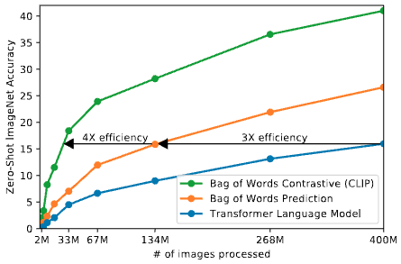

论文名称: Learning Transferable Visual Models From Natural Language Supervision

论文地址: https://arxiv.org/abs/2103.00020

readpaper地址: https://readpaper.com/pdf-annotate/note?pdfId=4498485025120608257&noteId=671513309851955200


## 摘要

State-of-the-art computer vision systems are trained to predict a fixed set of predetermined object categories. This restricted form of supervision limits their generality and usability since additional labeled data is needed to specify any other visual concept. Learning directly from raw text about images is a promising alternative which leverages a much broader source of supervision. We demonstrate that the simple pre-training task of predicting which caption goes with which image is an efficient and scalable way to learn SOTA image representations from scratch on a dataset of 400 million (image, text) pairs collected from the internet. After pre-training, natural language is used to reference learned visual concepts (or describe new ones) enabling zero-shot transfer of the model to downstream tasks. We study the performance of this approach by benchmarking on over 30 different existing computer vision datasets, spanning tasks such as OCR, action recognition in videos, geo-localization, and many types of fine-grained object classification. The model transfers non-trivially to most tasks and is often competitive with a fully supervised baseline without the need for any dataset specific training. For instance, we match the accuracy of the original ResNet-50 on ImageNet zero-shot without needing to use any of the 1.28 million training examples it was trained on. We release our code and pre-trained model weights at https://github.com/OpenAI/CLIP.


## 引言

Pre-training methods which learn directly from raw text have revolutionized(彻底改变) NLP over the last few years . (Dai &Le, 2015; Peters er al., 2018; Howard & Ruder, 2018; Radford et at., 2018; Devlin et al., 2018; Raffel et al., 2019). Task-agnostic objectives such as autoregressive and masked language modeling have scaled across many orders of magnitude in compute, model capacity, and data, steadily improving capabilities. The development of "text-to-text" as a standardized input-output interface (McCann et al., 2018; Radford et al., 2019; Raffel et al., 2019) has enabled taskagnostic architectures to zero-shot transfer to downstream datasets removing the need for specialized output heads or dataset specific customization.Flagship systems like GPT-3 (Brown et al., 2020) are now competitive across many tasks with bespoke models while requiring little to no dataset specific training data.


| 论文名称 | 论文标题翻译 | 论文别名 | 论文时间
| :------- | :------- | :------ | :--------
| Semi-supervised Sequence Learning                                                 | 基于半监督的序列学习                      | - | Dai &Le, 2015
| Deep contextualized word representations                                          | 深度上下文的词表达                        | - | Peters er al., 2018
| Universal Language Model Fine-tuning for Text Classification                      | 文本分类的通用语言模型微调方法              | ULMFiT | Howard & Ruder, 2018
| Improving Language Understanding by Generative Pre-Training                       | 通过生成式的预训练方式改善语言理解能力        | GPT | Radford et at., 2018 
| BERT: Pre-training of Deep Bidirectional Transformer for Language Understanding   | 用于语言理解的深度双向T预训练方法            | BERT | Devlin et al., 2018 
| Exploring the Limits of Transfer Learning with a Unified Text-to-Text Transformer | 使用一个统一的文本到文本的T来探索迁移学习的限制 | - | Raffel et al., 2019 
| The Natural Language Decathlon: Multitask Learning as Question Answering          | 自然语言十项全能：多任务学习当作问答          | MQAN | McCann et al., 2018 
| Language Models are Unsupervised Multitask Learners                               | 语言模型是无监督的多任务学习器               | GPT-2 | Radford er al, 2019 
| Language Models are Few-Shot Learners                                             | 语言模型是小样本学习器                      | GPT-3 | Brown et al., 2020


These results suggest that the aggregate supervision accessible to modern pre-training methods within web-scale collections of text surpasses that of high-quality crowd-labeled NLP datasets. However, in other fields such as computer vision it is still standard practice to pre-train models on crowd-labeled datasets such as ImageNet (Deng et al., 2009). Could scalable pre-training methods which learn directly from web text result in a similar breakthrough in computer vision? Prior work is encouraging.


| 论文名称 | 标题翻译 | 论文别名 | 论文时间
| :------- | :------- | :------ | :--------
| ImageNet: A large-scale hierarchical image database | 大规模分层图片数据库 | ImageNet | Deng et al., 2009


Over 20 years ago Mori et al. (1999) explored improving content based image retrieval by training a model to predict the nouns and adjectives in text documents paired with images. Quattoni et al. (2007) demonstrated it was possible to learn more data efficient image representations via manifold (流形)learning in the weight space of classifiers trained to predict words in captions associated with images. Srivastava & Salakhutdinov (2012) explored deep representation learning by training multimodal Deep Boltzmann Machines on top of low-level image and text tag features. Joulin et al.(2016) modernized this line of work and demonstrated that CNNs trained to predict words in image captions learn useful image representations. They converted the title, description, and hashtag（标签） metadata of images in the YFCC100M dataset (Thomee et al., 2016) into a bag-ofwords multi-label classification task and showed that pretraining AlexNet (Krizhevsky et al., 2012) to predict these labels learned representations which preformed similarly to ImageNet-based pre-training on transfer tasks. Li et al.(2017) then extended this approach to predicting phrase n-grams in addition to individual words and demonstrated the ability of their system to zero-shot transfer to other image classification datasets by scoring target classes based on their dictionary of learned visual n-grams and predicting the one with the highest score. Adopting more recent architecture and pre-training approaches, VirTex(Desai & Johnson,2020), ICMLM(Bulent Sariyildiz et al., 2020), and ConVIRT(Zhang et al., 2020) have recently demonstrated the potential of transformer-based language modeling, masked language modeling, and contrastive objectives to learn image representations from text.


| 论文名称 | 标题翻译 | 论文别名 | 论文时间
| :------- | :------- | :------ | :--------
| Image-to-word transformation based on dividing and vector quantizing images with words | 依据单词将图片分割并向量化，来实现图片到文本的转换 | - | Mori et al. (1999) 
| Learning Visual Representations using Images with Captions                             | 学习有字幕图片的视觉表征 | - | Quattoni et al. (2007)
| Multimodal Learning with Deep Boltzmann Machines                                       | 使用玻尔兹曼机做多模态学习| - | Srivastava & Salakhutdinov (2012)
| Learning Visual Features from Large Weakly Supervised Data                             | 从大规模的弱监督数据中学习视觉特征 | - | Joulin et al.(2016)
| YFCC100M: The New Data in Multimedia Research                                          | 用于多媒体研究的新数据集 | YFCC100M | (Thomee et al., 2016)
| ImageNet Classification with Deep Convolutional Neural Networks                        | 使用卷积神经网络来做ImageNet分类 | AlexNet | (Krizhevsky et al., 2012) 
| Learning Visual N-Grams from Web Data                                                  | 从网页数据中学习视觉n-grams | - | Li et al.(2017) 
| VirTex: Learning Visual Representations from Textual Annotations                       | 从文本注释中学习视觉表征 | VirTex | VirTex(Desai & Johnson,2020)
| Learning Visual Representations with Caption Annotations                               | 从字幕中学习是视觉表征 | ICMLM | ICMLM(Bulent Sariyildiz et al., 2020) 
| Contrastive Learning of Medical Visual Representations from Paired Images and Text     | 从配对的图片-文本中学习医疗视觉表征 | ConVIRT | ConVIRT(Zhang et al., 2020)


While exciting as proofs of concept, using natural language supervision for image representation learning is still rare. This is likely because demonstrated performance on common benchmarks is much lower than alternative approaches. For example, Li et al.(2017) reach only 15% accuracy on ImageNet in a zero-shot setting. This is well below the 88.4% accurary of the current state of the art (Xie et al., 2020). It is even below the 50% accuracy of classic computer vision approaches (Deng et al., 2012). Instead, more narrowly(狭隘地) scoped but well-targeted uses of weak supervision have improved performance. Mahajan et al.(2018) showed that predicting ImageNet-related hashtags(标签) on Instagram images is an effective pre-training task. When fine-tuned to ImageNet these pre-training models increased accuracy by 5% and improved the overall(全面的) state of the art at the time.Kolesnikov et al. (2019) and Dosovitskiy et al. (2020) have also demonstrated large grains on a broader set of transfer benchmarks by pre-training models to predicts the classes of the noisily labeled JFT-300M dataset.


| 论文名称 | 标题翻译 | 论文别名 | 论文时间
| :------- | :------- | :------ | :--------
| Learning Visual N-Grams from Web Data                                                  | 从网页数据中学习视觉n-grams | - | Li et al.(2017) 
| Self-training with Noisy Student improves ImageNet classification                      | 使用噪声学生的自学习来提升图片分类效果 | - | (Xie et al., 2020)
| Exploring the Limits of Weakly Supervised Pretraining                                  | 探索弱监督预训练的限制 | - | Mahajan et al.(2018)
| Large Scale Learning of General Visual Representations for Transfer                    | 学习大规模通用视觉表征用于迁移学习 | BiT |  Kolesnikov et al. (2019)
| An Image is Worth 16x16 Words: Transformers for Image Recognition at Scale             | transformer用于图片分类 | ViT | Dosovitskiy et al. (2020)


This line of work represents the current pragmatic(务实的) middle ground（中间立场）between learning from a limited amount of supervised "gold-labels" learning from practically unlimited amounts of raw text. However, it it not without compromises(然而，这并非不能妥协). Both words carefully design, and in the process limit, their supervision to 1000 and 18291 classes respectively. Natural language is able to express, supervise, a much wider set of visual concepts through its generality. Both approaches also use static softmax classfifiers to perform prediction and lack a mechanism for dynamic outputs. This severely(严重地) curtails（削减了） their flexibility and limits their "zero-shot" capabilities.


A crucial difference between these weakly supervised models and recent explorations of learning image representations directly from natural language is scale(是成规模的). While Mahajan et al.(2018) and Kolesnikov et al. (2019) trained their models for accelerator years on millions to billions of images, VirTex, ICMLM, and ConVIRT trained for accelerator days on one to two hundred thousand images. In this work, we close this gap and study the behaviors of image classifiers trained with natural language supervision at large scale. Enabled by the large amounts of publicly available data of this form on the internet, we create a new dataset of 400 million (image, text) pairs and demonstrate that a simplified version of ConvVIRT trained from scratch, which we call CLIP, for Contrastive Language-Image  Pre-training, is an efficient method of learning from natural language supervision. We study the scalability of CLIP by training a series of eight models spanning almost 2 orders of magnitude of compute and observe that transfer performance is a smoothly predictable function of compute (Hestness et al., 2017; Kaplan et al., 2020). We find that CLIP, similar to the GPT family, learns to perform a wide set of tasks during pre-training including OCR, geo-localization, action recognition, and many others. We measure this by benchmarking the zero-shot transfer performance of CLIP on over 30 existing datasets and find it can be competitive with prior task-specific supervised models. We also confirm(确认) these findings with linear-probe() representation learning analysis and show that CLIP outperforms the best publicly available ImageNet model while also being more computationally efficient. We additionally find that zero-shot CLIP models are much more robust than equivalent(相等的) accuracy supervised ImageNet models which suggests that zero-shot evaluation of task-agnostic models is much more representative of a model's capability. (我们还发现，零样本 CLIP 模型比同等精度的监督 ImageNet 模型更稳健，这表明任务无关模型的零样本评估更能代表模型的能力). These results have significant policy(政策的) and ethical（伦理的） implications, which we consifer in Section 7.


| 论文名称 | 标题翻译 | 论文别名 | 论文时间
| :------- | :------- | :------ | :--------
| Exploring the Limits of Weakly Supervised Pretraining                                  | 探索弱监督预训练的限制 | - | Mahajan et al.(2018)
| Large Scale Learning of General Visual Representations for Transfer                    | 学习大规模通用视觉表征用于迁移学习 | BiT |  Kolesnikov et al. (2019)
| Deep Learning Scaling is Predictable, Empirically                                      | 深度学习的扩展情况是可预测的，是有经验值的 | - | Hestness et al., 2017
| Scaling Laws for Neural Language Models                                                | 自然语言模型的扩展规则 | - | Kaplan et al., 2020


## 方法


#### 自然语言监督 
At the core of our approach is the idea of learning perception from supervision contained in natural language. As discussed in the introduction, this is not at all a new idea, however, terminology(术语) used to describe work in this space is varied, even seemingly contradictory(矛盾的), and stated motivations are diverse. Zhang et al. (2020), Gomez et al. (2017), Joulin et al. (2016), and Desai & Johnson (2020) all introduce methods which learn visual representations from text paired with images but describe their approaches as unsupervised, self-supervised, weakly supervised, and supervised respectively.


| 论文名称 | 标题翻译 | 论文别名 | 论文时间
| :------- | :------- | :------ | :--------
| Contrastive Learning of Medical Visual Representations from Paired Images and Text     | 从配对的图片-文本中学习医疗视觉表征 | ConVIRT | ConVIRT(Zhang et al., 2020)
| Self-Supervised Learning of Visual Features through Embedding Images into Text Topic Spaces | 通过把图片嵌入到文本空间中，来用自监督的方式学习视觉特征 | - | Gomez et al. (2017)
| Learning Visual Features from Large Weakly Supervised Data                             | 从大规模的弱监督数据中学习视觉特征 | - | Joulin et al.(2016)
| VirTex: Learning Visual Representations from Textual Annotations                       | 从文本注释中学习视觉表征 | VirTex | VirTex(Desai & Johnson,2020)

We emphasize that what is common across this line of work is not any of the details of th particular methods used but the appreciation(欣赏) of natural language as a training signal(把自然语言作为一种训练信号). All these approaches are learning from natrual language supervision. Although early work wrestled(摔跤) with the complexity of natural language when using topic model and n-gram representations, improvements in deep contextual representation learning suggest we now have the tools to effectively leverage（利用） this abundant source of supervision(McCann et al., 2017).


| 论文名称 | 标题翻译 | 论文别名 | 论文时间
| :------- | :------- | :------ | :--------
| Learned in Translation: Contextualized Word Vectors                                    | 上下文词向量，学习用于翻译 | - | McCann et al., 2017

Learning from natual language has several potential strengths(优势) over other training methods. It's much easier to scale natural language supervision compared to standard crowd-sourced labeling 
for image classification since it does not require annotations to be in a classic "mechine learning compatible(兼容的) format" such as the canonical(典范) 1-of-N majority vote "gold label". Instead, methods which work on natural language can learn passively(被动的) from the supervision contained  in the vast amount of text on the internet. Learning from natural language also has an important advantage over most unsupervised or self-supervised learning approaches in that it doesn't "just" learn a representation but also connects that repesentation to language which enables flexible zero-shot transfer. (与大多数无监督或自监督学习方法相比，从自然语言中学习还有一个重要的优势，因为它不仅“只是”学习一种表示，而且还将这种表示与语言联系起来，从而实现灵活的零样本迁移)
In the following subsections, we detail the specific approach we settled on.


#### Creating a Sufficiently Large Dataset

Existing work has mainly used three datasets, MS-COCO(Lin et al., 2014), Visual Genome(Krishna et al., 2017), and YFCC100M(Thomee et al., 2016). While MS-COCO and Visual Genome are high quality crowd-labeled datasets, they are small by modern standards with approximately 100,000 training photos each. By comparison, other computer vision systems are trained on up to 3.5 billion  Instagram photos(Mahajan et al., 2018). YFCC100M, at 100 million photos, is a possible alternative, but the metadata for each image is sparse and of varying quality(稀疏且质量参差不齐的). Many images use automatically generated filenames like 20160716_113957.JPG as "titles" or contain "descriptions" of camera exposure settings. After filtering to keep only images with natural language titles and/or descriptions in English, the dataset shrunk by a factor of 6 to only 15 million photos. This is approximately the same size as ImageNet.


A major motivation for natural language supervision is the large quantities of data of this form available publicly on the internet. Since existing datasets do not adequately(充分地) reflect this possibility, considering results only on them would underestimate(低估) the potential of this line of research.(现有的数据集量级比较小，因此不能完全反映出用海量互联网的自然语言数据做监督能做成事情的可能性，仅仅使用这样的数据集，可能会低估这方面研究的潜力). To address this, we constructed a new dataset of 400 million (image,text) pairs collected form a variety of publicly available sources on the Internet. To attempt to cover as broad a set of visual concepts as possible, we search for (image, text) pairs as part of the construction process(构建数据过程中) whose text includes one of a set of 500,000 queries. We approximately class balance the results by including up to 20,000(image,text) pairs per query. The resulting dataset has a similar total word count as the WebText dataset used to train GPT-2. We refer to this dataset as WIT for WebImageText.


| 论文名称 | 标题翻译 | 论文别名 | 论文时间
| :------- | :------- | :------ | :--------
| Microsoft COCO: Common Objects in Context | 上下文中的常见物体 | COCO | Lin et al., 2014
| Visual Genome: Connecting Language and Vision Using Crowd sourced Dense Image Annotations | 视觉基因组: 使用众包的密集图像标注来连接语言和视觉 | - | Krishna et al., 2017
| YFCC100M: The New Data in Multimedia Research | 多媒体研究中的新数据集 | YFCC100M | Thomee et al., 2016
| Exploring the Limits of Weakly Supervised Pretraining                                  | 探索弱监督预训练的限制 | - | Mahajan et al.(2018)


#### 2.3 Selecting an Efficient Pre-Training Method

State-of-the-art computer vision systems use very large amounts of compute. Mahajan et al.(2018) required 19 GPU years to train their ResNeXt101-32x48d and Xie et al.(2020) required 33 TPUv3 core-years to train their Noisy Student EfficientNet-L2. When considering that both these systems were trained to predict only 1000 ImageNet classes, the task of learning an open set of visual concepts from natural language seems daunting(令人生畏). In the course of our efforts, we found training efficiency(训练效率) was key to successfully scaling natural language supervision(成功扩展自然语言监督的关键) and we selected our final pre-training method based on this metric.

| 论文名称 | 标题翻译 | 论文别名 | 论文时间
| :------- | :------- | :------ | :--------
| Exploring the Limits of Weakly Supervised Pretraining                                  | 探索弱监督预训练的限制 | - | Mahajan et al.(2018)
| Self-training with Noisy Student improves ImageNet classification                      | 使用噪声学生的自学习来提升图片分类效果 | - | (Xie et al., 2020)


Our initial approach, similar to VirTex, jointly trained an image CNN and text transformer from scratch to predict the caption of an image. However, we encountered difficulties efficiently scaling this method. In Figure 2 we show that a 63 million parameter transformer language model, which already uses twice the compute of its ResNet-50 image encoder, learns to recognize ImageNet classes three times slower than a much simpler baseline that predicts a bag-of-words encoding of the same text. 


Both these approaches share a key similarity. They try to predict the exact words of the text accompanying each image. This is a difficult task due to the wide variety of descriptions, comments, and related text that co-occur with images. Recent work in contrastive representation learning for images has found that contrastive objectives can learn better representations than their equivalent predictive objective (Tian et al., 2019). Other work has found that although generative models of images can learn high quality image representations, they require over an order of magnitude (超过一个数量级) of more compute than contrastive models with the same performance(Chen et al., 2020a). Noting these findings, we explored training a system to solve the potentially easier proxy task of predicting only which text as a whole(整个文本) is paired with which image and not the exact words(确切的词) of that text. Starting with the same bag-of-words encoding baseline, we swapped the predictive objective for a contrastive objective in Figure 2 and observed a further 4x efficientcy improvement in the rate of zero-shot transfer to ImageNet.


| 论文名称 | 标题翻译 | 论文别名 | 论文时间
| :------- | :------- | :------ | :--------
| Contrastive Multiview Coding | 对比的多角度编码 | - | Tian et al., 2019
| Generative Pretraining From Pixels | 从像素做生成式的预训练 | - | Chen et al., 2020a



图2 **CLIP is much more efficient at zero-shot transfer than our image caption baseline.** Althougn highly expressive(富有表现力), we found that transformer-based language models are relatively weak at zero-shot ImageNet classification. Here, we see that it learns 3x slower than a baseline which predicts a bag-of-words(BoW) encoding of the text(Joulin et al., 2016). Swapping the prediction objective for the contrastive objective of CLIP further improves efficiency another 4x.


Given a batch of N(image, text)pairs, CLIP is trained to predict which of the NxN possible(image, text) pairings across a batch actually occurred. To do this, CLIP learns a multi-modal embedding space by jointly training an image encoder and text encoder to maximize the cosine similarity of the image and text embeddings of the N real pairs in the batch while minimizeing the cosine similarity of the embeddings of the N^2 - N incorrect pairings. We optimize a symmetric cross entropy loss over these similarity scores. In figure 3, we include pseudocode of the core of an implementation of CLIP. To our knowledge this batch construction technique and objectives was first introduced in area of deep metric learning as the multi-class N-pair loss Sohn(2016) was popularized for contrastive representation learning by Oord et al.(2018) as the InfoNCE loss, 


| 论文名称 | 标题翻译 | 论文别名 | 论文时间
| :------- | :------- | :------ | :--------
| Improved deep metric learning with multi-class N-pair loss objective | 使用多分类的多对的损失函数来提升深度评估学习能力 | - 2016-12-05


```python
# image_encoder - ResNet of Vision Transformer
# text_encoder  - CBOW or Text Transformer
# I[n, h, w, c] - minibatch of aligned images
# T[n, l]       - minibatch of aligned texts
# W_i[d_i, d_e] - learned proj of image to embed
# W_t[d_t, d_e] - learned proj of text to embed
# t             - learned temperature parameter

# extract feature representations of each modality
I_f = image_encoder(I) # [n, d_i]
T_f = text_encoder(T)  # [n, d_t]

# joint multimodal embedding [n, d_e]
I_e = l2_normalize(np.dot(I_f, W_i), axis=1)
T_e = l2_normalize(np.dot(T_f, W_t), axis=1)

# scaled pairwise cosine similarities [n, n]
logits = np.dot(I_e, T_e.T) * np.exp(t)

# symmetric loss function
labels = np.arange(n)
loss_i = cross_entropy_loss(logits, labels, axis=0)
loss_t = cross_entropy_loss(logits, labels, axis=1)
loss = (loss_i + loss_t) / 2
```

图3 Numpy-like pseudocode for the core of an implementation of CLIP